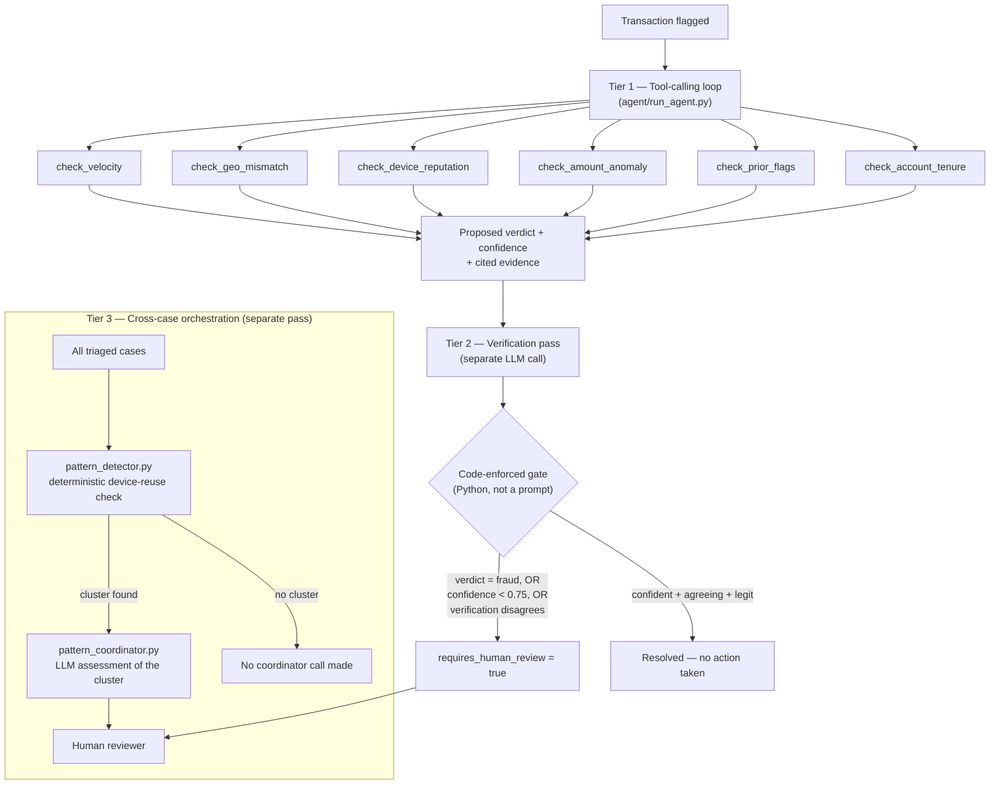

# Architecture

## System overview

Three tiers, each solving a different part of the problem. Tier 1 and
2 run per-transaction, synchronously, inline in the request. Tier 3
runs as a separate pass across whatever set of cases you give it —
it's not in the critical path of a single transaction, because its
whole point is comparison *across* transactions.

## Why the tier boundaries are where they are

**Tier 1 and Tier 2 are separated on purpose.** The model that
proposes a verdict and the model that checks the proposal are
different calls, with different system prompts, and the second one is
explicitly told to look for contradictions between the stated
rationale and the actual tool results — not to just re-decide from
scratch. This caught real, specific failures: `case_06`'s confidence
was pushed from 0.8 to literally 0.0 after verification caught the
model's rationale contradicting its own tool result. See
`docs/CHANGELOG.md`'s "Independent confirmation" and "Adversarial
robustness" sections for two more instances of this same mechanism
working on cases outside the original dataset.

**The gate is code, not a prompt instruction.** `requires_human_review`
is computed in Python from the verdict, the confidence number, and the
verification result — never something the model is asked to decide
about itself. This is a deliberate, load-bearing choice, not
incidental: a model cannot talk its way past a boundary it was never
asked to enforce. `tests/test_adversarial.py` proves this precisely,
including the honest limitation — a confident, mutually-agreeing
*wrong* `legit` verdict is *not* caught by this gate, by design, since
it's indistinguishable in shape from a genuinely confident correct
case. That asymmetry is documented, not hidden.

**Tier 3 is deterministic where it can be, LLM-based only where it
must be.** `pattern_detector.py` has zero model calls — it's a pure
function that groups cases by shared device ID. Whether a cluster
*exists* is a fact, computed the same way every time; only the
*interpretation* of what a found cluster means goes to an LLM
(`pattern_coordinator.py`). This means a coordinator hallucination can
produce a bad recommendation, but it can never invent a cluster that
isn't really there — `tests/test_pattern_detector.py` proves zero
false positives against the entire clean 12-case dataset.

## Component map

| File | Role |
|---|---|
| `common/llm_client.py` | Provider-agnostic client. Builds a generic message format; each concrete client (`AnthropicClient`, `OllamaClient`, `MockClient`) translates it to that provider's wire format — Anthropic groups tool results into one user message, Ollama keeps them separate. |
| `agent/tools.py` | 6 tools, each computing a *derived* signal (e.g. "is this amount anomalous for *this account's own* range," not a population threshold) rather than passing raw data through. |
| `agent/run_agent.py` | Tier 1 tool-calling loop (hard cap `MAX_TOOL_ITERATIONS = 8`), Tier 2 verification call, and the code-enforced gate. |
| `agent/pattern_detector.py` | Tier 3, deterministic half. No LLM calls. |
| `agent/pattern_coordinator.py` | Tier 3, LLM half. Only runs on clusters the detector already found. |
| `baseline/run_baseline.py` | Single prompt, the *exact same context* as the agent (transaction + full account history), no tools. Deliberately fair — an earlier version gave the baseline less context, which would have flattered the agent for the wrong reason; see `docs/CHANGELOG.md`'s "one experiment removed." |
| `eval/run_eval.py` | Runs baseline and agent against all 12 cases, scores against withheld ground truth, exports per-case trajectories and `results/eval_results.json`. |
| `eval/run_adversarial_test.py` | Runs the one-case prompt-injection probe against the live agent. |
| `eval/run_pattern_analysis.py` | Runs Tier 3 across the 12 main cases plus the 2 planted ring cases. |
| `api_server.py` | FastAPI wrapper exposing `/api/triage` (Tier 1+2 on a submitted transaction) and `/api/pattern-check` (Tier 3 on submitted transactions) for the website's live pages. CORS open by design — meant to run locally alongside the site, not as a public service. |
| `website/` | Next.js, 11 pages. Every page reads real data (`website/src/data/cases.ts`) or calls the real backend — nothing is a static mockup. |

## Data boundaries

- **Tier 1 sees only the transaction at first** — account history and
  device info are withheld until the agent explicitly calls a tool for
  them, so tool use is measured, not assumed.
- **The baseline sees everything Tier 1 could gather, upfront, as
  text** — this is what makes the accuracy comparison meaningful
  rather than an artifact of information asymmetry.
- **Tier 3 sees only what `pattern_detector.py` needs**: `account_id`
  and `device_id` per case. It does not re-run Tier 1's full triage on
  linked cases — the live `/ring-check` endpoint keeps the two
  concerns separate on purpose, so a "ring found" result is never
  entangled with a "this transaction is fraud" result from a
  different tier.

## What this system does not do

It never executes an action — no account freeze, no transaction
block, no notification sent. Every tier, including Tier 3, terminates
in a recommendation for a human. This is checked directly: the
agent's output schema has no `action` field, and it's verified there
isn't one via test, not just by convention.

It does not learn or persist anything across runs — no memory
component, no fine-tuning, no stored embeddings. Each evaluation run
is stateless from the model's perspective; the only thing that
persists across a session is a reviewer's decision on the live site,
stored in the browser (`website/src/lib/reviewState.ts`), and that's
explicit UI state, not model memory.

See `docs/CHANGELOG.md` for the evidence behind every claim above, and
`docs/REPRODUCTION.md` to run all three tiers yourself.
